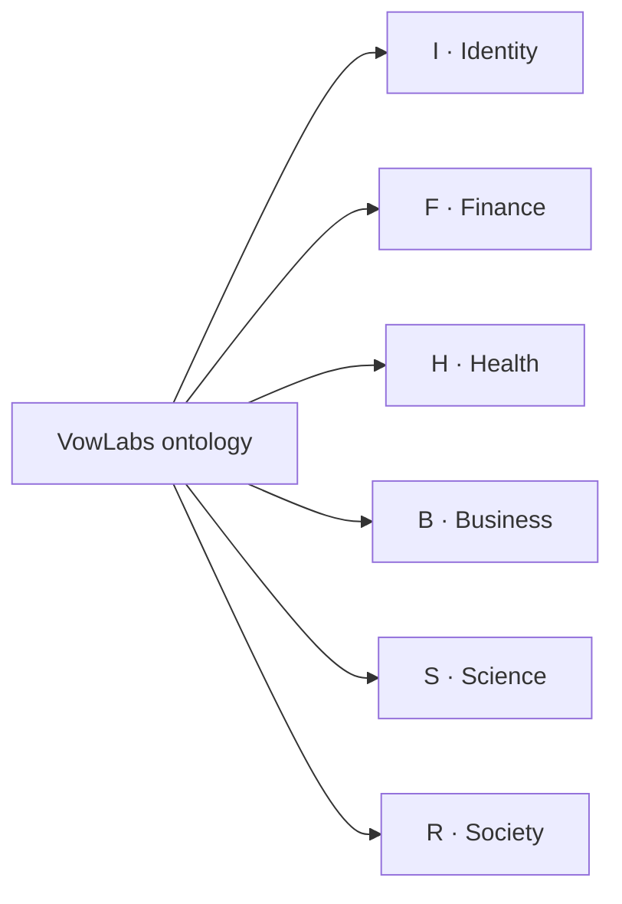
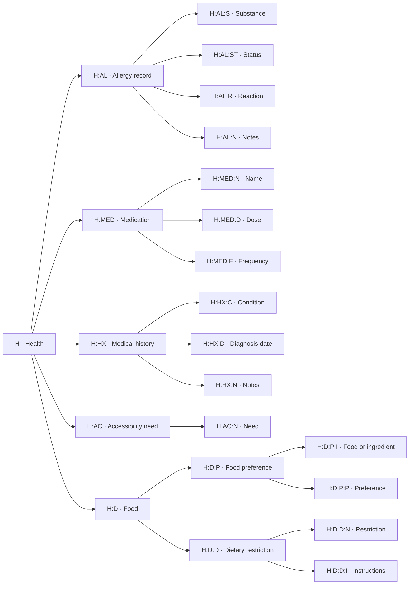
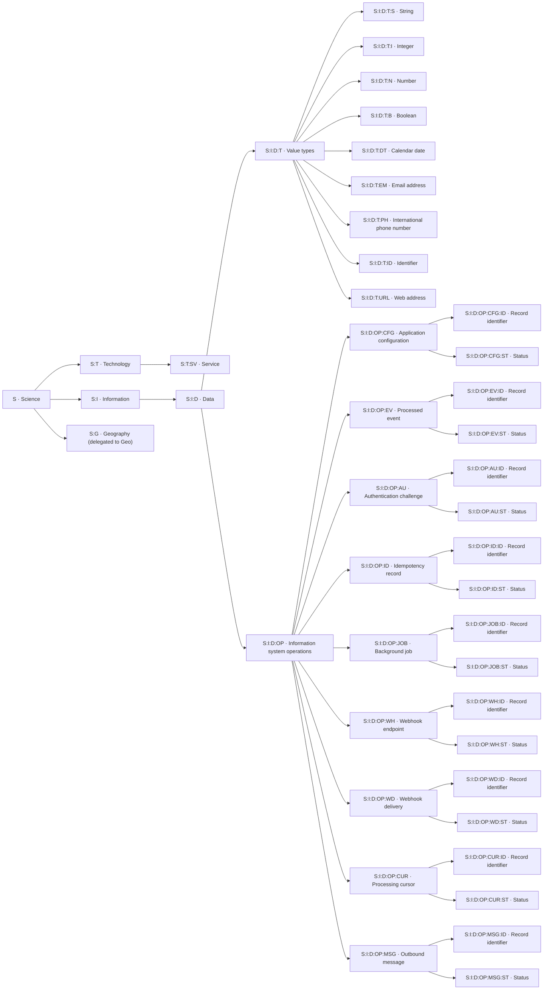
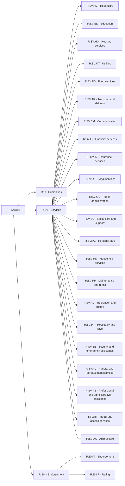

# Datapoint taxonomy

[Back to the ontology README](../README.md#datapoint-taxonomy-graph)

This graph documents the 376 local definitions (including the root) in
ontology `10.2.0`, following `Children` references from [index.json](../index.json).
Each domain graph includes every local descendant, with its canonical code.

Arrows mean parent–child containment. Organizing branches, classification
concepts, records, and answer fields all appear in the tree; fields are not
subtypes of their containing record. `Type`, `Choices`, and record references
are separate relationships and are not drawn here. Reference-data entries
(such as named professions and services) and application records are not
ontology nodes.

`S:G` stops at the delegated Geography boundary. Its descendants and datasets
are owned by Geo and are not part of this local snapshot. See the
[delegation guide](../Science/Geography/README.md).

When `Children`, names, codes, or delegation boundaries change, update these
graphs and the README overview to match the canonical definitions.

## Domains

## Identity (`I`)

[Domain guide](../Identity/README.md) · 66 local definitions.

```mermaid
flowchart LR
    n_I["I · Identity"]
    n_I_P["I:P · Individual"]
    n_I_P_LN["I:P:LN · Legal name"]
    n_I_P_DN["I:P:DN · Display Name"]
    n_I_P_DOB["I:P:DOB · Date of birth"]
    n_I_P_COB["I:P:COB · Country of birth"]
    n_I_P_SSN["I:P:SSN · US Social Security number"]
    n_I_P_IMG["I:P:IMG · Profile image"]
    n_I_O["I:O · Organization"]
    n_I_O_LN["I:O:LN · Legal name"]
    n_I_O_TN["I:O:TN · Trading name"]
    n_I_O_J["I:O:J · Registration jurisdiction"]
    n_I_O_RN["I:O:RN · Registration number"]
    n_I_O_T["I:O:T · Organization type"]
    n_I_O_FY["I:O:FY · Formation year"]
    n_I_O_FJ["I:O:FJ · Formation jurisdiction"]
    n_I_O_HQ["I:O:HQ · Headquarters address"]
    n_I_O_D["I:O:D · Description"]
    n_I_O_K["I:O:K · Organization types"]
    n_I_O_K_SP["I:O:K:SP · Sole Proprietorship"]
    n_I_O_K_LLC["I:O:K:LLC · Limited Liability Company (LLC)"]
    n_I_O_K_GP["I:O:K:GP · General Partnership"]
    n_I_O_K_LP["I:O:K:LP · Limited Partnership (LP)"]
    n_I_O_K_LLP["I:O:K:LLP · Limited Liability Partnership (LLP)"]
    n_I_O_K_SC["I:O:K:SC · S Corporation"]
    n_I_O_K_CC["I:O:K:CC · C Corporation"]
    n_I_O_K_PRIVATE["I:O:K:PRIVATE · Privately Held Corporation"]
    n_I_O_K_PUBLIC["I:O:K:PUBLIC · Publicly Traded Corporation"]
    n_I_O_K_NP["I:O:K:NP · Nonprofit Organization"]
    n_I_O_K_COOP["I:O:K:COOP · Cooperative"]
    n_I_O_K_TR["I:O:K:TR · Trust"]
    n_I_O_K_GOV["I:O:K:GOV · Government Entity"]
    n_I_O_K_UA["I:O:K:UA · Unincorporated Association"]
    n_I_O_K_FD["I:O:K:FD · Foundation"]
    n_I_O_K_CORP["I:O:K:CORP · Corporation"]
    n_I_ID["I:ID · External identifier"]
    n_I_ID_S["I:ID:S · Scheme"]
    n_I_ID_V["I:ID:V · Value"]
    n_I_ID_IS["I:ID:IS · Issuer"]
    n_I_C["I:C · Contact"]
    n_I_C_SM["I:C:SM · Social media"]
    n_I_C_SM_S["I:C:SM:S · Service"]
    n_I_C_SM_ID["I:C:SM:ID · Identifier"]
    n_I_C_EM["I:C:EM · Electronic mail"]
    n_I_C_PH["I:C:PH · Phone"]
    n_I_C_URL["I:C:URL · Website"]
    n_I_C_BOOK["I:C:BOOK · Calendar booking"]
    n_I_C_AD["I:C:AD · Address"]
    n_I_DOC["I:DOC · Documents"]
    n_I_DOC_DL["I:DOC:DL · Driver licence"]
    n_I_DOC_DL_N["I:DOC:DL:N · Document number"]
    n_I_DOC_DL_CO["I:DOC:DL:CO · Issuing country"]
    n_I_DOC_DL_IS["I:DOC:DL:IS · Issuing authority"]
    n_I_DOC_DL_ISS["I:DOC:DL:ISS · Issue date"]
    n_I_DOC_DL_EXP["I:DOC:DL:EXP · Expiry date"]
    n_I_DOC_DL_RE["I:DOC:DL:RE · Issuing region"]
    n_I_DOC_DL_CL["I:DOC:DL:CL · Licence classes"]
    n_I_DOC_DL_RS["I:DOC:DL:RS · Restrictions and endorsements"]
    n_I_DOC_PP["I:DOC:PP · Passport"]
    n_I_DOC_PP_N["I:DOC:PP:N · Document number"]
    n_I_DOC_PP_CO["I:DOC:PP:CO · Issuing country"]
    n_I_DOC_PP_IS["I:DOC:PP:IS · Issuing authority"]
    n_I_DOC_PP_ISS["I:DOC:PP:ISS · Issue date"]
    n_I_DOC_PP_EXP["I:DOC:PP:EXP · Expiry date"]
    n_I_DOC_PP_TY["I:DOC:PP:TY · Passport type"]
    n_I_DOC_PP_NA["I:DOC:PP:NA · Nationality"]
    n_I --> n_I_P
    n_I --> n_I_O
    n_I --> n_I_ID
    n_I --> n_I_C
    n_I --> n_I_DOC
    n_I_P --> n_I_P_LN
    n_I_P --> n_I_P_DN
    n_I_P --> n_I_P_DOB
    n_I_P --> n_I_P_COB
    n_I_P --> n_I_P_SSN
    n_I_P --> n_I_P_IMG
    n_I_O --> n_I_O_LN
    n_I_O --> n_I_O_TN
    n_I_O --> n_I_O_J
    n_I_O --> n_I_O_RN
    n_I_O --> n_I_O_T
    n_I_O --> n_I_O_FY
    n_I_O --> n_I_O_FJ
    n_I_O --> n_I_O_HQ
    n_I_O --> n_I_O_D
    n_I_O --> n_I_O_K
    n_I_O_K --> n_I_O_K_SP
    n_I_O_K --> n_I_O_K_LLC
    n_I_O_K --> n_I_O_K_GP
    n_I_O_K --> n_I_O_K_LP
    n_I_O_K --> n_I_O_K_LLP
    n_I_O_K --> n_I_O_K_SC
    n_I_O_K --> n_I_O_K_CC
    n_I_O_K --> n_I_O_K_PRIVATE
    n_I_O_K --> n_I_O_K_PUBLIC
    n_I_O_K --> n_I_O_K_NP
    n_I_O_K --> n_I_O_K_COOP
    n_I_O_K --> n_I_O_K_TR
    n_I_O_K --> n_I_O_K_GOV
    n_I_O_K --> n_I_O_K_UA
    n_I_O_K --> n_I_O_K_FD
    n_I_O_K --> n_I_O_K_CORP
    n_I_ID --> n_I_ID_S
    n_I_ID --> n_I_ID_V
    n_I_ID --> n_I_ID_IS
    n_I_C --> n_I_C_SM
    n_I_C --> n_I_C_EM
    n_I_C --> n_I_C_PH
    n_I_C --> n_I_C_URL
    n_I_C --> n_I_C_BOOK
    n_I_C --> n_I_C_AD
    n_I_C_SM --> n_I_C_SM_S
    n_I_C_SM --> n_I_C_SM_ID
    n_I_DOC --> n_I_DOC_DL
    n_I_DOC --> n_I_DOC_PP
    n_I_DOC_DL --> n_I_DOC_DL_N
    n_I_DOC_DL --> n_I_DOC_DL_CO
    n_I_DOC_DL --> n_I_DOC_DL_IS
    n_I_DOC_DL --> n_I_DOC_DL_ISS
    n_I_DOC_DL --> n_I_DOC_DL_EXP
    n_I_DOC_DL --> n_I_DOC_DL_RE
    n_I_DOC_DL --> n_I_DOC_DL_CL
    n_I_DOC_DL --> n_I_DOC_DL_RS
    n_I_DOC_PP --> n_I_DOC_PP_N
    n_I_DOC_PP --> n_I_DOC_PP_CO
    n_I_DOC_PP --> n_I_DOC_PP_IS
    n_I_DOC_PP --> n_I_DOC_PP_ISS
    n_I_DOC_PP --> n_I_DOC_PP_EXP
    n_I_DOC_PP --> n_I_DOC_PP_TY
    n_I_DOC_PP --> n_I_DOC_PP_NA
```

Source definitions

- [`I` — Identity](../Identity/index.json)
- [`I:P` — Individual](../Identity/Person/index.json)
- [`I:P:LN` — Legal name](../Identity/Person/LegalName.json)
- [`I:P:DN` — Display Name](../Identity/Person/DisplayName.json)
- [`I:P:DOB` — Date of birth](../Identity/Person/BirthDate.json)
- [`I:P:COB` — Country of birth](../Identity/Person/BirthCountry.json)
- [`I:P:SSN` — US Social Security number](../Identity/Person/SocialSecurityNumber.json)
- [`I:P:IMG` — Profile image](../Identity/Person/ProfileImage.json)
- [`I:O` — Organization](../Identity/Organization/index.json)
- [`I:O:LN` — Legal name](../Identity/Organization/LegalName.json)
- [`I:O:TN` — Trading name](../Identity/Organization/TradingName.json)
- [`I:O:J` — Registration jurisdiction](../Identity/Organization/Jurisdiction.json)
- [`I:O:RN` — Registration number](../Identity/Organization/RegistrationNumber.json)
- [`I:O:T` — Organization type](../Identity/Organization/OrganizationType.json)
- [`I:O:FY` — Formation year](../Identity/Organization/FormationYear.json)
- [`I:O:FJ` — Formation jurisdiction](../Identity/Organization/FormationJurisdiction.json)
- [`I:O:HQ` — Headquarters address](../Identity/Organization/HeadquartersAddress.json)
- [`I:O:D` — Description](../Identity/Organization/Description.json)
- [`I:O:K` — Organization types](../Identity/Organization/Types/index.json)
- [`I:O:K:SP` — Sole Proprietorship](../Identity/Organization/Types/SP.json)
- [`I:O:K:LLC` — Limited Liability Company (LLC)](../Identity/Organization/Types/LLC.json)
- [`I:O:K:GP` — General Partnership](../Identity/Organization/Types/GP.json)
- [`I:O:K:LP` — Limited Partnership (LP)](../Identity/Organization/Types/LP.json)
- [`I:O:K:LLP` — Limited Liability Partnership (LLP)](../Identity/Organization/Types/LLP.json)
- [`I:O:K:SC` — S Corporation](../Identity/Organization/Types/SC.json)
- [`I:O:K:CC` — C Corporation](../Identity/Organization/Types/CC.json)
- [`I:O:K:PRIVATE` — Privately Held Corporation](../Identity/Organization/Types/PRIVATE.json)
- [`I:O:K:PUBLIC` — Publicly Traded Corporation](../Identity/Organization/Types/PUBLIC.json)
- [`I:O:K:NP` — Nonprofit Organization](../Identity/Organization/Types/NP.json)
- [`I:O:K:COOP` — Cooperative](../Identity/Organization/Types/COOP.json)
- [`I:O:K:TR` — Trust](../Identity/Organization/Types/TR.json)
- [`I:O:K:GOV` — Government Entity](../Identity/Organization/Types/GOV.json)
- [`I:O:K:UA` — Unincorporated Association](../Identity/Organization/Types/UA.json)
- [`I:O:K:FD` — Foundation](../Identity/Organization/Types/FD.json)
- [`I:O:K:CORP` — Corporation](../Identity/Organization/Types/CORP.json)
- [`I:ID` — External identifier](../Identity/Identifiers/index.json)
- [`I:ID:S` — Scheme](../Identity/Identifiers/Scheme.json)
- [`I:ID:V` — Value](../Identity/Identifiers/Value.json)
- [`I:ID:IS` — Issuer](../Identity/Identifiers/Issuer.json)
- [`I:C` — Contact](../Identity/Contact/index.json)
- [`I:C:SM` — Social media](../Identity/Contact/Social/index.json)
- [`I:C:SM:S` — Service](../Identity/Contact/Social/Service.json)
- [`I:C:SM:ID` — Identifier](../Identity/Contact/Social/Handle.json)
- [`I:C:EM` — Electronic mail](../Identity/Contact/Email.json)
- [`I:C:PH` — Phone](../Identity/Contact/Phone.json)
- [`I:C:URL` — Website](../Identity/Contact/Website.json)
- [`I:C:BOOK` — Calendar booking](../Identity/Contact/Booking.json)
- [`I:C:AD` — Address](../Identity/Contact/Address.json)
- [`I:DOC` — Documents](../Identity/Documents/index.json)
- [`I:DOC:DL` — Driver licence](../Identity/Documents/DriverLicence/index.json)
- [`I:DOC:DL:N` — Document number](../Identity/Documents/DriverLicence/Number.json)
- [`I:DOC:DL:CO` — Issuing country](../Identity/Documents/DriverLicence/Country.json)
- [`I:DOC:DL:IS` — Issuing authority](../Identity/Documents/DriverLicence/Issuer.json)
- [`I:DOC:DL:ISS` — Issue date](../Identity/Documents/DriverLicence/Issued.json)
- [`I:DOC:DL:EXP` — Expiry date](../Identity/Documents/DriverLicence/Expiry.json)
- [`I:DOC:DL:RE` — Issuing region](../Identity/Documents/DriverLicence/Region.json)
- [`I:DOC:DL:CL` — Licence classes](../Identity/Documents/DriverLicence/Classes.json)
- [`I:DOC:DL:RS` — Restrictions and endorsements](../Identity/Documents/DriverLicence/Restrictions.json)
- [`I:DOC:PP` — Passport](../Identity/Documents/Passport/index.json)
- [`I:DOC:PP:N` — Document number](../Identity/Documents/Passport/Number.json)
- [`I:DOC:PP:CO` — Issuing country](../Identity/Documents/Passport/Country.json)
- [`I:DOC:PP:IS` — Issuing authority](../Identity/Documents/Passport/Issuer.json)
- [`I:DOC:PP:ISS` — Issue date](../Identity/Documents/Passport/Issued.json)
- [`I:DOC:PP:EXP` — Expiry date](../Identity/Documents/Passport/Expiry.json)
- [`I:DOC:PP:TY` — Passport type](../Identity/Documents/Passport/PassportType.json)
- [`I:DOC:PP:NA` — Nationality](../Identity/Documents/Passport/Nationality.json)

## Finance (`F`)

[Domain guide](../Finance/README.md) · 102 local definitions.

```mermaid
flowchart LR
    n_F["F · Finance"]
    n_F_BA["F:BA · Bank account"]
    n_F_BA_H["F:BA:H · Account holder"]
    n_F_BA_B["F:BA:B · Bank"]
    n_F_BA_S["F:BA:S · Identifier scheme"]
    n_F_BA_ID["F:BA:ID · Account identifier"]
    n_F_WA["F:WA · Wallet address"]
    n_F_WA_N["F:WA:N · Network"]
    n_F_WA_A["F:WA:A · Address"]
    n_F_PI["F:PI · Payment instrument reference"]
    n_F_PI_P["F:PI:P · Provider"]
    n_F_PI_R["F:PI:R · Reference"]
    n_F_PI_L4["F:PI:L4 · Last four digits"]
    n_F_A["F:A · Assets"]
    n_F_A_V["F:A:V · Vehicle"]
    n_F_A_V_MK["F:A:V:MK · Make"]
    n_F_A_V_MD["F:A:V:MD · Model"]
    n_F_A_V_Y["F:A:V:Y · Model year"]
    n_F_A_V_VIN["F:A:V:VIN · Vehicle identification number"]
    n_F_A_V_REG["F:A:V:REG · Registration plate"]
    n_F_A_V_USE["F:A:V:USE · Usage"]
    n_F_A_P["F:A:P · Property"]
    n_F_A_P_N["F:A:P:N · Label"]
    n_F_A_P_AD["F:A:P:AD · Address"]
    n_F_A_P_O["F:A:P:O · Occupancy"]
    n_F_A_P_Y["F:A:P:Y · Year built"]
    n_F_INV["F:INV · Invoice"]
    n_F_INV_ID["F:INV:ID · Record identifier"]
    n_F_INV_ST["F:INV:ST · Status"]
    n_F_SP["F:SP · Settlement proof"]
    n_F_SP_ID["F:SP:ID · Record identifier"]
    n_F_SP_ST["F:SP:ST · Status"]
    n_F_RF["F:RF · Refund"]
    n_F_RF_ID["F:RF:ID · Record identifier"]
    n_F_RF_ST["F:RF:ST · Status"]
    n_F_P["F:P · Product"]
    n_F_P_AC["F:P:AC · Account"]
    n_F_P_AC_BA["F:P:AC:BA · Bank account"]
    n_F_P_AC_BA_CU["F:P:AC:BA:CU · Current account"]
    n_F_P_AC_BA_SA["F:P:AC:BA:SA · Savings account"]
    n_F_P_AC_BA_TD["F:P:AC:BA:TD · Term deposit"]
    n_F_P_AC_BA_MM["F:P:AC:BA:MM · Money market deposit account"]
    n_F_P_AC_BR["F:P:AC:BR · Brokerage account"]
    n_F_P_AC_CU["F:P:AC:CU · Custody account"]
    n_F_P_CR["F:P:CR · Credit"]
    n_F_P_CR_CA["F:P:CR:CA · Credit card"]
    n_F_P_CR_CH["F:P:CR:CH · Charge card"]
    n_F_P_CR_LN["F:P:CR:LN · Loan"]
    n_F_P_CR_LN_MO["F:P:CR:LN:MO · Mortgage loan"]
    n_F_P_CR_LN_PE["F:P:CR:LN:PE · Personal loan"]
    n_F_P_CR_LN_VE["F:P:CR:LN:VE · Vehicle loan"]
    n_F_P_CR_LN_ED["F:P:CR:LN:ED · Education loan"]
    n_F_P_CR_LN_BU["F:P:CR:LN:BU · Business loan"]
    n_F_P_CR_LN_BN["F:P:CR:LN:BN · Buy now, pay later"]
    n_F_P_CR_LC["F:P:CR:LC · Line of credit"]
    n_F_P_CR_LE["F:P:CR:LE · Finance lease"]
    n_F_P_CR_TF["F:P:CR:TF · Trade and receivables finance"]
    n_F_P_IN["F:P:IN · Investment"]
    n_F_P_IN_EQ["F:P:IN:EQ · Equity"]
    n_F_P_IN_EQ_ST["F:P:IN:EQ:ST · Stock"]
    n_F_P_IN_EQ_ST_CO["F:P:IN:EQ:ST:CO · Common stock"]
    n_F_P_IN_EQ_ST_PR["F:P:IN:EQ:ST:PR · Preferred stock"]
    n_F_P_IN_EQ_DR["F:P:IN:EQ:DR · Depositary receipt"]
    n_F_P_IN_DE["F:P:IN:DE · Debt security"]
    n_F_P_IN_DE_BO["F:P:IN:DE:BO · Bond"]
    n_F_P_IN_DE_BI["F:P:IN:DE:BI · Bill"]
    n_F_P_IN_DE_NO["F:P:IN:DE:NO · Note"]
    n_F_P_IN_DE_CP["F:P:IN:DE:CP · Commercial paper"]
    n_F_P_IN_DE_CD["F:P:IN:DE:CD · Negotiable certificate of deposit"]
    n_F_P_IN_DE_AB["F:P:IN:DE:AB · Asset-backed security"]
    n_F_P_IN_FU["F:P:IN:FU · Fund"]
    n_F_P_IN_FU_MF["F:P:IN:FU:MF · Mutual fund"]
    n_F_P_IN_FU_ET["F:P:IN:FU:ET · Exchange-traded fund"]
    n_F_P_IN_FU_CE["F:P:IN:FU:CE · Closed-end fund"]
    n_F_P_IN_FU_PF["F:P:IN:FU:PF · Private fund"]
    n_F_P_IN_DR["F:P:IN:DR · Derivative"]
    n_F_P_IN_DR_OP["F:P:IN:DR:OP · Option"]
    n_F_P_IN_DR_FU["F:P:IN:DR:FU · Future"]
    n_F_P_IN_DR_FW["F:P:IN:DR:FW · Forward"]
    n_F_P_IN_DR_SW["F:P:IN:DR:SW · Swap"]
    n_F_P_IN_DR_CF["F:P:IN:DR:CF · Contract for difference"]
    n_F_P_IN_DR_WA["F:P:IN:DR:WA · Warrant"]
    n_F_P_IN_ST["F:P:IN:ST · Structured investment"]
    n_F_P_PA["F:P:PA · Payment"]
    n_F_P_PA_DC["F:P:PA:DC · Debit card"]
    n_F_P_PA_PC["F:P:PA:PC · Prepaid card"]
    n_F_P_PA_EM["F:P:PA:EM · Electronic money account"]
    n_F_P_IS["F:P:IS · Insurance"]
    n_F_P_IS_LI["F:P:IS:LI · Life insurance"]
    n_F_P_IS_HE["F:P:IS:HE · Health insurance"]
    n_F_P_IS_DI["F:P:IS:DI · Disability and income protection"]
    n_F_P_IS_PR["F:P:IS:PR · Property insurance"]
    n_F_P_IS_LA["F:P:IS:LA · Liability insurance"]
    n_F_P_IS_MO["F:P:IS:MO · Motor insurance"]
    n_F_P_IS_TR["F:P:IS:TR · Travel insurance"]
    n_F_P_IS_AN["F:P:IS:AN · Annuity"]
    n_F_P_RE["F:P:RE · Retirement"]
    n_F_P_RE_PE["F:P:RE:PE · Pension arrangement"]
    n_F_P_RE_AC["F:P:RE:AC · Retirement account"]
    n_F_P_DA["F:P:DA · Native digital asset"]
    n_F_P_DA_CR["F:P:DA:CR · Unbacked cryptoasset"]
    n_F_P_DA_ST["F:P:DA:ST · Stablecoin"]
    n_F --> n_F_BA
    n_F_BA --> n_F_BA_H
    n_F_BA --> n_F_BA_B
    n_F_BA --> n_F_BA_S
    n_F_BA --> n_F_BA_ID
    n_F --> n_F_WA
    n_F_WA --> n_F_WA_N
    n_F_WA --> n_F_WA_A
    n_F --> n_F_PI
    n_F_PI --> n_F_PI_P
    n_F_PI --> n_F_PI_R
    n_F_PI --> n_F_PI_L4
    n_F --> n_F_A
    n_F_A --> n_F_A_V
    n_F_A_V --> n_F_A_V_MK
    n_F_A_V --> n_F_A_V_MD
    n_F_A_V --> n_F_A_V_Y
    n_F_A_V --> n_F_A_V_VIN
    n_F_A_V --> n_F_A_V_REG
    n_F_A_V --> n_F_A_V_USE
    n_F_A --> n_F_A_P
    n_F_A_P --> n_F_A_P_N
    n_F_A_P --> n_F_A_P_AD
    n_F_A_P --> n_F_A_P_O
    n_F_A_P --> n_F_A_P_Y
    n_F --> n_F_INV
    n_F_INV --> n_F_INV_ID
    n_F_INV --> n_F_INV_ST
    n_F --> n_F_SP
    n_F_SP --> n_F_SP_ID
    n_F_SP --> n_F_SP_ST
    n_F --> n_F_RF
    n_F_RF --> n_F_RF_ID
    n_F_RF --> n_F_RF_ST
    n_F --> n_F_P
    n_F_P --> n_F_P_AC
    n_F_P_AC --> n_F_P_AC_BA
    n_F_P_AC_BA --> n_F_P_AC_BA_CU
    n_F_P_AC_BA --> n_F_P_AC_BA_SA
    n_F_P_AC_BA --> n_F_P_AC_BA_TD
    n_F_P_AC_BA --> n_F_P_AC_BA_MM
    n_F_P_AC --> n_F_P_AC_BR
    n_F_P_AC --> n_F_P_AC_CU
    n_F_P --> n_F_P_CR
    n_F_P_CR --> n_F_P_CR_CA
    n_F_P_CR --> n_F_P_CR_CH
    n_F_P_CR --> n_F_P_CR_LN
    n_F_P_CR_LN --> n_F_P_CR_LN_MO
    n_F_P_CR_LN --> n_F_P_CR_LN_PE
    n_F_P_CR_LN --> n_F_P_CR_LN_VE
    n_F_P_CR_LN --> n_F_P_CR_LN_ED
    n_F_P_CR_LN --> n_F_P_CR_LN_BU
    n_F_P_CR_LN --> n_F_P_CR_LN_BN
    n_F_P_CR --> n_F_P_CR_LC
    n_F_P_CR --> n_F_P_CR_LE
    n_F_P_CR --> n_F_P_CR_TF
    n_F_P --> n_F_P_IN
    n_F_P_IN --> n_F_P_IN_EQ
    n_F_P_IN_EQ --> n_F_P_IN_EQ_ST
    n_F_P_IN_EQ_ST --> n_F_P_IN_EQ_ST_CO
    n_F_P_IN_EQ_ST --> n_F_P_IN_EQ_ST_PR
    n_F_P_IN_EQ --> n_F_P_IN_EQ_DR
    n_F_P_IN --> n_F_P_IN_DE
    n_F_P_IN_DE --> n_F_P_IN_DE_BO
    n_F_P_IN_DE --> n_F_P_IN_DE_BI
    n_F_P_IN_DE --> n_F_P_IN_DE_NO
    n_F_P_IN_DE --> n_F_P_IN_DE_CP
    n_F_P_IN_DE --> n_F_P_IN_DE_CD
    n_F_P_IN_DE --> n_F_P_IN_DE_AB
    n_F_P_IN --> n_F_P_IN_FU
    n_F_P_IN_FU --> n_F_P_IN_FU_MF
    n_F_P_IN_FU --> n_F_P_IN_FU_ET
    n_F_P_IN_FU --> n_F_P_IN_FU_CE
    n_F_P_IN_FU --> n_F_P_IN_FU_PF
    n_F_P_IN --> n_F_P_IN_DR
    n_F_P_IN_DR --> n_F_P_IN_DR_OP
    n_F_P_IN_DR --> n_F_P_IN_DR_FU
    n_F_P_IN_DR --> n_F_P_IN_DR_FW
    n_F_P_IN_DR --> n_F_P_IN_DR_SW
    n_F_P_IN_DR --> n_F_P_IN_DR_CF
    n_F_P_IN_DR --> n_F_P_IN_DR_WA
    n_F_P_IN --> n_F_P_IN_ST
    n_F_P --> n_F_P_PA
    n_F_P_PA --> n_F_P_PA_DC
    n_F_P_PA --> n_F_P_PA_PC
    n_F_P_PA --> n_F_P_PA_EM
    n_F_P --> n_F_P_IS
    n_F_P_IS --> n_F_P_IS_LI
    n_F_P_IS --> n_F_P_IS_HE
    n_F_P_IS --> n_F_P_IS_DI
    n_F_P_IS --> n_F_P_IS_PR
    n_F_P_IS --> n_F_P_IS_LA
    n_F_P_IS --> n_F_P_IS_MO
    n_F_P_IS --> n_F_P_IS_TR
    n_F_P_IS --> n_F_P_IS_AN
    n_F_P --> n_F_P_RE
    n_F_P_RE --> n_F_P_RE_PE
    n_F_P_RE --> n_F_P_RE_AC
    n_F_P --> n_F_P_DA
    n_F_P_DA --> n_F_P_DA_CR
    n_F_P_DA --> n_F_P_DA_ST
```

Source definitions

- [`F` — Finance](../Finance/index.json)
- [`F:BA` — Bank account](../Finance/BankAccount/index.json)
- [`F:BA:H` — Account holder](../Finance/BankAccount/Holder.json)
- [`F:BA:B` — Bank](../Finance/BankAccount/Bank.json)
- [`F:BA:S` — Identifier scheme](../Finance/BankAccount/Scheme.json)
- [`F:BA:ID` — Account identifier](../Finance/BankAccount/Identifier.json)
- [`F:WA` — Wallet address](../Finance/Wallet/index.json)
- [`F:WA:N` — Network](../Finance/Wallet/Network.json)
- [`F:WA:A` — Address](../Finance/Wallet/Address.json)
- [`F:PI` — Payment instrument reference](../Finance/PaymentInstrument/index.json)
- [`F:PI:P` — Provider](../Finance/PaymentInstrument/Provider.json)
- [`F:PI:R` — Reference](../Finance/PaymentInstrument/Reference.json)
- [`F:PI:L4` — Last four digits](../Finance/PaymentInstrument/LastFour.json)
- [`F:A` — Assets](../Finance/Assets/index.json)
- [`F:A:V` — Vehicle](../Finance/Assets/Vehicle/index.json)
- [`F:A:V:MK` — Make](../Finance/Assets/Vehicle/Make.json)
- [`F:A:V:MD` — Model](../Finance/Assets/Vehicle/Model.json)
- [`F:A:V:Y` — Model year](../Finance/Assets/Vehicle/Year.json)
- [`F:A:V:VIN` — Vehicle identification number](../Finance/Assets/Vehicle/VIN.json)
- [`F:A:V:REG` — Registration plate](../Finance/Assets/Vehicle/Registration.json)
- [`F:A:V:USE` — Usage](../Finance/Assets/Vehicle/Use.json)
- [`F:A:P` — Property](../Finance/Assets/Property/index.json)
- [`F:A:P:N` — Label](../Finance/Assets/Property/Name.json)
- [`F:A:P:AD` — Address](../Finance/Assets/Property/Address.json)
- [`F:A:P:O` — Occupancy](../Finance/Assets/Property/Occupancy.json)
- [`F:A:P:Y` — Year built](../Finance/Assets/Property/YearBuilt.json)
- [`F:INV` — Invoice](../Finance/Invoice/index.json)
- [`F:INV:ID` — Record identifier](../Finance/Invoice/Id.json)
- [`F:INV:ST` — Status](../Finance/Invoice/Status.json)
- [`F:SP` — Settlement proof](../Finance/SettlementProof/index.json)
- [`F:SP:ID` — Record identifier](../Finance/SettlementProof/Id.json)
- [`F:SP:ST` — Status](../Finance/SettlementProof/Status.json)
- [`F:RF` — Refund](../Finance/Refund/index.json)
- [`F:RF:ID` — Record identifier](../Finance/Refund/Id.json)
- [`F:RF:ST` — Status](../Finance/Refund/Status.json)
- [`F:P` — Product](../Finance/Product/index.json)
- [`F:P:AC` — Account](../Finance/Product/Account/index.json)
- [`F:P:AC:BA` — Bank account](../Finance/Product/Account/Bank/index.json)
- [`F:P:AC:BA:CU` — Current account](../Finance/Product/Account/Bank/Current/index.json)
- [`F:P:AC:BA:SA` — Savings account](../Finance/Product/Account/Bank/Savings/index.json)
- [`F:P:AC:BA:TD` — Term deposit](../Finance/Product/Account/Bank/TermDeposit/index.json)
- [`F:P:AC:BA:MM` — Money market deposit account](../Finance/Product/Account/Bank/MoneyMarket/index.json)
- [`F:P:AC:BR` — Brokerage account](../Finance/Product/Account/Brokerage/index.json)
- [`F:P:AC:CU` — Custody account](../Finance/Product/Account/Custody/index.json)
- [`F:P:CR` — Credit](../Finance/Product/Credit/index.json)
- [`F:P:CR:CA` — Credit card](../Finance/Product/Credit/Card/index.json)
- [`F:P:CR:CH` — Charge card](../Finance/Product/Credit/ChargeCard/index.json)
- [`F:P:CR:LN` — Loan](../Finance/Product/Credit/Loan/index.json)
- [`F:P:CR:LN:MO` — Mortgage loan](../Finance/Product/Credit/Loan/Mortgage/index.json)
- [`F:P:CR:LN:PE` — Personal loan](../Finance/Product/Credit/Loan/Personal/index.json)
- [`F:P:CR:LN:VE` — Vehicle loan](../Finance/Product/Credit/Loan/Vehicle/index.json)
- [`F:P:CR:LN:ED` — Education loan](../Finance/Product/Credit/Loan/Education/index.json)
- [`F:P:CR:LN:BU` — Business loan](../Finance/Product/Credit/Loan/Business/index.json)
- [`F:P:CR:LN:BN` — Buy now, pay later](../Finance/Product/Credit/Loan/BuyNowPayLater/index.json)
- [`F:P:CR:LC` — Line of credit](../Finance/Product/Credit/LineOfCredit/index.json)
- [`F:P:CR:LE` — Finance lease](../Finance/Product/Credit/FinanceLease/index.json)
- [`F:P:CR:TF` — Trade and receivables finance](../Finance/Product/Credit/TradeFinance/index.json)
- [`F:P:IN` — Investment](../Finance/Product/Investment/index.json)
- [`F:P:IN:EQ` — Equity](../Finance/Product/Investment/Equity/index.json)
- [`F:P:IN:EQ:ST` — Stock](../Finance/Product/Investment/Equity/Stock/index.json)
- [`F:P:IN:EQ:ST:CO` — Common stock](../Finance/Product/Investment/Equity/Stock/Common/index.json)
- [`F:P:IN:EQ:ST:PR` — Preferred stock](../Finance/Product/Investment/Equity/Stock/Preferred/index.json)
- [`F:P:IN:EQ:DR` — Depositary receipt](../Finance/Product/Investment/Equity/DepositaryReceipt/index.json)
- [`F:P:IN:DE` — Debt security](../Finance/Product/Investment/DebtSecurity/index.json)
- [`F:P:IN:DE:BO` — Bond](../Finance/Product/Investment/DebtSecurity/Bond/index.json)
- [`F:P:IN:DE:BI` — Bill](../Finance/Product/Investment/DebtSecurity/Bill/index.json)
- [`F:P:IN:DE:NO` — Note](../Finance/Product/Investment/DebtSecurity/Note/index.json)
- [`F:P:IN:DE:CP` — Commercial paper](../Finance/Product/Investment/DebtSecurity/CommercialPaper/index.json)
- [`F:P:IN:DE:CD` — Negotiable certificate of deposit](../Finance/Product/Investment/DebtSecurity/NegotiableCertificateOfDeposit/index.json)
- [`F:P:IN:DE:AB` — Asset-backed security](../Finance/Product/Investment/DebtSecurity/AssetBacked/index.json)
- [`F:P:IN:FU` — Fund](../Finance/Product/Investment/Fund/index.json)
- [`F:P:IN:FU:MF` — Mutual fund](../Finance/Product/Investment/Fund/Mutual/index.json)
- [`F:P:IN:FU:ET` — Exchange-traded fund](../Finance/Product/Investment/Fund/ExchangeTraded/index.json)
- [`F:P:IN:FU:CE` — Closed-end fund](../Finance/Product/Investment/Fund/ClosedEnd/index.json)
- [`F:P:IN:FU:PF` — Private fund](../Finance/Product/Investment/Fund/Private/index.json)
- [`F:P:IN:DR` — Derivative](../Finance/Product/Investment/Derivative/index.json)
- [`F:P:IN:DR:OP` — Option](../Finance/Product/Investment/Derivative/Option/index.json)
- [`F:P:IN:DR:FU` — Future](../Finance/Product/Investment/Derivative/Future/index.json)
- [`F:P:IN:DR:FW` — Forward](../Finance/Product/Investment/Derivative/Forward/index.json)
- [`F:P:IN:DR:SW` — Swap](../Finance/Product/Investment/Derivative/Swap/index.json)
- [`F:P:IN:DR:CF` — Contract for difference](../Finance/Product/Investment/Derivative/ContractForDifference/index.json)
- [`F:P:IN:DR:WA` — Warrant](../Finance/Product/Investment/Derivative/Warrant/index.json)
- [`F:P:IN:ST` — Structured investment](../Finance/Product/Investment/Structured/index.json)
- [`F:P:PA` — Payment](../Finance/Product/Payment/index.json)
- [`F:P:PA:DC` — Debit card](../Finance/Product/Payment/DebitCard/index.json)
- [`F:P:PA:PC` — Prepaid card](../Finance/Product/Payment/PrepaidCard/index.json)
- [`F:P:PA:EM` — Electronic money account](../Finance/Product/Payment/ElectronicMoney/index.json)
- [`F:P:IS` — Insurance](../Finance/Product/Insurance/index.json)
- [`F:P:IS:LI` — Life insurance](../Finance/Product/Insurance/Life/index.json)
- [`F:P:IS:HE` — Health insurance](../Finance/Product/Insurance/Health/index.json)
- [`F:P:IS:DI` — Disability and income protection](../Finance/Product/Insurance/Disability/index.json)
- [`F:P:IS:PR` — Property insurance](../Finance/Product/Insurance/Property/index.json)
- [`F:P:IS:LA` — Liability insurance](../Finance/Product/Insurance/Liability/index.json)
- [`F:P:IS:MO` — Motor insurance](../Finance/Product/Insurance/Motor/index.json)
- [`F:P:IS:TR` — Travel insurance](../Finance/Product/Insurance/Travel/index.json)
- [`F:P:IS:AN` — Annuity](../Finance/Product/Insurance/Annuity/index.json)
- [`F:P:RE` — Retirement](../Finance/Product/Retirement/index.json)
- [`F:P:RE:PE` — Pension arrangement](../Finance/Product/Retirement/Pension/index.json)
- [`F:P:RE:AC` — Retirement account](../Finance/Product/Retirement/Account/index.json)
- [`F:P:DA` — Native digital asset](../Finance/Product/DigitalAsset/index.json)
- [`F:P:DA:CR` — Unbacked cryptoasset](../Finance/Product/DigitalAsset/Cryptoasset/index.json)
- [`F:P:DA:ST` — Stablecoin](../Finance/Product/DigitalAsset/Stablecoin/index.json)

## Health (`H`)

[Domain guide](../Health/README.md) · 23 local definitions.

Source definitions

- [`H` — Health](../Health/index.json)
- [`H:AL` — Allergy record](../Health/Allergy/index.json)
- [`H:AL:S` — Substance](../Health/Allergy/Substance.json)
- [`H:AL:ST` — Status](../Health/Allergy/Status.json)
- [`H:AL:R` — Reaction](../Health/Allergy/Reaction.json)
- [`H:AL:N` — Notes](../Health/Allergy/Notes.json)
- [`H:MED` — Medication](../Health/Medication/index.json)
- [`H:MED:N` — Name](../Health/Medication/Name.json)
- [`H:MED:D` — Dose](../Health/Medication/Dose.json)
- [`H:MED:F` — Frequency](../Health/Medication/Frequency.json)
- [`H:HX` — Medical history](../Health/History/index.json)
- [`H:HX:C` — Condition](../Health/History/Condition.json)
- [`H:HX:D` — Diagnosis date](../Health/History/Date.json)
- [`H:HX:N` — Notes](../Health/History/Notes.json)
- [`H:AC` — Accessibility need](../Health/Accessibility/index.json)
- [`H:AC:N` — Need](../Health/Accessibility/Need.json)
- [`H:D` — Food](../Health/Food/index.json)
- [`H:D:P` — Food preference](../Health/Food/Preference/index.json)
- [`H:D:P:I` — Food or ingredient](../Health/Food/Preference/Item.json)
- [`H:D:P:P` — Preference](../Health/Food/Preference/Preference.json)
- [`H:D:D` — Dietary restriction](../Health/Food/Diet/index.json)
- [`H:D:D:N` — Restriction](../Health/Food/Diet/Name.json)
- [`H:D:D:I` — Instructions](../Health/Food/Diet/Instructions.json)

## Business (`B`)

[Domain guide](../Business/README.md) · 112 local definitions.

```mermaid
flowchart LR
    n_B["B · Business"]
    n_B_IN["B:IN · Insurance policy"]
    n_B_IN_T["B:IN:T · Policy type"]
    n_B_IN_P["B:IN:P · Provider"]
    n_B_IN_N["B:IN:N · Policy number"]
    n_B_IN_END["B:IN:END · Expiry date"]
    n_B_EMP["B:EMP · Employment"]
    n_B_EMP_O["B:EMP:O · Employer"]
    n_B_EMP_R["B:EMP:R · Role"]
    n_B_EMP_S["B:EMP:S · Start date"]
    n_B_C["B:C · Commerce"]
    n_B_C_M["B:C:M · Merchant"]
    n_B_C_M_ID["B:C:M:ID · Record identifier"]
    n_B_C_M_ST["B:C:M:ST · Status"]
    n_B_C_M_N["B:C:M:N · Business name"]
    n_B_C_M_W["B:C:M:W · Wallet address"]
    n_B_C_M_U["B:C:M:U · Website"]
    n_B_C_ML["B:C:ML · Merchant list"]
    n_B_C_ML_ID["B:C:ML:ID · List identifier"]
    n_B_C_ML_N["B:C:ML:N · List name"]
    n_B_C_O["B:C:O · Offer"]
    n_B_C_O_ID["B:C:O:ID · Record identifier"]
    n_B_C_O_ST["B:C:O:ST · Status"]
    n_B_C_O_M["B:C:O:M · Merchant identifier"]
    n_B_C_O_T["B:C:O:T · Title"]
    n_B_C_O_D["B:C:O:D · Description"]
    n_B_C_O_U["B:C:O:U · Acceptance URL"]
    n_B_C_O_I["B:C:O:I · Image URL"]
    n_B_C_OR["B:C:OR · Order"]
    n_B_C_OR_ID["B:C:OR:ID · Record identifier"]
    n_B_C_OR_ST["B:C:OR:ST · Status"]
    n_B_C_OL["B:C:OL · Order line"]
    n_B_C_OL_ID["B:C:OL:ID · Record identifier"]
    n_B_C_OL_ST["B:C:OL:ST · Status"]
    n_B_C_P["B:C:P · Product"]
    n_B_C_P_ID["B:C:P:ID · Record identifier"]
    n_B_C_P_ST["B:C:P:ST · Status"]
    n_B_C_P_N["B:C:P:N · Name"]
    n_B_C_CK["B:C:CK · Checkout"]
    n_B_C_CK_ID["B:C:CK:ID · Record identifier"]
    n_B_C_CK_ST["B:C:CK:ST · Status"]
    n_B_C_FU["B:C:FU · Fulfillment"]
    n_B_C_FU_ID["B:C:FU:ID · Record identifier"]
    n_B_C_FU_ST["B:C:FU:ST · Status"]
    n_B_C_WL["B:C:WL · Wishlist"]
    n_B_C_WL_ID["B:C:WL:ID · Record identifier"]
    n_B_C_WL_ST["B:C:WL:ST · Status"]
    n_B_C_SI["B:C:SI · Sale intent"]
    n_B_C_SI_ID["B:C:SI:ID · Record identifier"]
    n_B_C_SI_ST["B:C:SI:ST · Status"]
    n_B_C_OA["B:C:OA · Offer response"]
    n_B_C_OA_ID["B:C:OA:ID · Record identifier"]
    n_B_C_OA_ST["B:C:OA:ST · Status"]
    n_B_C_ME["B:C:ME · Merchant enrollment"]
    n_B_C_ME_ID["B:C:ME:ID · Record identifier"]
    n_B_C_ME_ST["B:C:ME:ST · Status"]
    n_B_C_CP["B:C:CP · Customer profile"]
    n_B_C_CP_ID["B:C:CP:ID · Record identifier"]
    n_B_C_CP_ST["B:C:CP:ST · Status"]
    n_B_C_ON["B:C:ON · Onboarding"]
    n_B_C_ON_ID["B:C:ON:ID · Record identifier"]
    n_B_C_ON_ST["B:C:ON:ST · Status"]
    n_B_C_MB["B:C:MB · Membership"]
    n_B_C_MB_ID["B:C:MB:ID · Record identifier"]
    n_B_C_MB_ST["B:C:MB:ST · Status"]
    n_B_C_SU["B:C:SU · Support request"]
    n_B_C_SU_ID["B:C:SU:ID · Record identifier"]
    n_B_C_SU_ST["B:C:SU:ST · Status"]
    n_B_C_NS["B:C:NS · Newsletter subscription"]
    n_B_C_NS_ID["B:C:NS:ID · Record identifier"]
    n_B_C_NS_ST["B:C:NS:ST · Status"]
    n_B_C_RC["B:C:RC · Recruiter"]
    n_B_C_RC_ID["B:C:RC:ID · Record identifier"]
    n_B_C_RC_ST["B:C:RC:ST · Status"]
    n_B_C_RA["B:C:RA · Recruiter assignment"]
    n_B_C_RA_ID["B:C:RA:ID · Record identifier"]
    n_B_C_RA_ST["B:C:RA:ST · Status"]
    n_B_C_MN["B:C:MN · Menu"]
    n_B_C_MN_ID["B:C:MN:ID · Record identifier"]
    n_B_C_MN_ST["B:C:MN:ST · Status"]
    n_B_C_MT["B:C:MT · Merchant category"]
    n_B_C_MT_ID["B:C:MT:ID · Record identifier"]
    n_B_C_MT_ST["B:C:MT:ST · Status"]
    n_B_C_PM["B:C:PM · Purchase mandate"]
    n_B_C_PM_ID["B:C:PM:ID · Record identifier"]
    n_B_C_PM_ST["B:C:PM:ST · Status"]
    n_B_C_MU["B:C:MU · Mandate use"]
    n_B_C_MU_ID["B:C:MU:ID · Record identifier"]
    n_B_C_MU_ST["B:C:MU:ST · Status"]
    n_B_C_MR["B:C:MR · Mandate reservation"]
    n_B_C_MR_ID["B:C:MR:ID · Record identifier"]
    n_B_C_MR_ST["B:C:MR:ST · Status"]
    n_B_C_OE["B:C:OE · Order event"]
    n_B_C_OE_ID["B:C:OE:ID · Record identifier"]
    n_B_C_OE_ST["B:C:OE:ST · Status"]
    n_B_PRO["B:PRO · Profession"]
    n_B_SV["B:SV · Services"]
    n_B_SV_AC["B:SV:AC · Accounting and payroll"]
    n_B_SV_HR["B:SV:HR · Human resources"]
    n_B_SV_MK["B:SV:MK · Marketing and sales support"]
    n_B_SV_IT["B:SV:IT · IT operations"]
    n_B_SV_LG["B:SV:LG · Organizational legal and compliance"]
    n_B_SV_AD["B:SV:AD · Office and administrative support"]
    n_B_SV_FM["B:SV:FM · Facilities operations"]
    n_B_SV_SC["B:SV:SC · Procurement and supply-chain support"]
    n_B_SV_MC["B:SV:MC · Management and organizational advice"]
    n_B_SV_TC["B:SV:TC · Technical and quality assurance"]
    n_B_SV_FI["B:SV:FI · Business financial services"]
    n_B_SV_IN["B:SV:IN · Commercial insurance services"]
    n_B_SV_ED["B:SV:ED · Workforce training"]
    n_B_SV_HC["B:SV:HC · Workplace health services"]
    n_B_SV_FD["B:SV:FD · Workplace catering"]
    n_B --> n_B_IN
    n_B_IN --> n_B_IN_T
    n_B_IN --> n_B_IN_P
    n_B_IN --> n_B_IN_N
    n_B_IN --> n_B_IN_END
    n_B --> n_B_EMP
    n_B_EMP --> n_B_EMP_O
    n_B_EMP --> n_B_EMP_R
    n_B_EMP --> n_B_EMP_S
    n_B --> n_B_C
    n_B_C --> n_B_C_M
    n_B_C_M --> n_B_C_M_ID
    n_B_C_M --> n_B_C_M_ST
    n_B_C_M --> n_B_C_M_N
    n_B_C_M --> n_B_C_M_W
    n_B_C_M --> n_B_C_M_U
    n_B_C --> n_B_C_ML
    n_B_C_ML --> n_B_C_ML_ID
    n_B_C_ML --> n_B_C_ML_N
    n_B_C --> n_B_C_O
    n_B_C_O --> n_B_C_O_ID
    n_B_C_O --> n_B_C_O_ST
    n_B_C_O --> n_B_C_O_M
    n_B_C_O --> n_B_C_O_T
    n_B_C_O --> n_B_C_O_D
    n_B_C_O --> n_B_C_O_U
    n_B_C_O --> n_B_C_O_I
    n_B_C --> n_B_C_OR
    n_B_C_OR --> n_B_C_OR_ID
    n_B_C_OR --> n_B_C_OR_ST
    n_B_C --> n_B_C_OL
    n_B_C_OL --> n_B_C_OL_ID
    n_B_C_OL --> n_B_C_OL_ST
    n_B_C --> n_B_C_P
    n_B_C_P --> n_B_C_P_ID
    n_B_C_P --> n_B_C_P_ST
    n_B_C_P --> n_B_C_P_N
    n_B_C --> n_B_C_CK
    n_B_C_CK --> n_B_C_CK_ID
    n_B_C_CK --> n_B_C_CK_ST
    n_B_C --> n_B_C_FU
    n_B_C_FU --> n_B_C_FU_ID
    n_B_C_FU --> n_B_C_FU_ST
    n_B_C --> n_B_C_WL
    n_B_C_WL --> n_B_C_WL_ID
    n_B_C_WL --> n_B_C_WL_ST
    n_B_C --> n_B_C_SI
    n_B_C_SI --> n_B_C_SI_ID
    n_B_C_SI --> n_B_C_SI_ST
    n_B_C --> n_B_C_OA
    n_B_C_OA --> n_B_C_OA_ID
    n_B_C_OA --> n_B_C_OA_ST
    n_B_C --> n_B_C_ME
    n_B_C_ME --> n_B_C_ME_ID
    n_B_C_ME --> n_B_C_ME_ST
    n_B_C --> n_B_C_CP
    n_B_C_CP --> n_B_C_CP_ID
    n_B_C_CP --> n_B_C_CP_ST
    n_B_C --> n_B_C_ON
    n_B_C_ON --> n_B_C_ON_ID
    n_B_C_ON --> n_B_C_ON_ST
    n_B_C --> n_B_C_MB
    n_B_C_MB --> n_B_C_MB_ID
    n_B_C_MB --> n_B_C_MB_ST
    n_B_C --> n_B_C_SU
    n_B_C_SU --> n_B_C_SU_ID
    n_B_C_SU --> n_B_C_SU_ST
    n_B_C --> n_B_C_NS
    n_B_C_NS --> n_B_C_NS_ID
    n_B_C_NS --> n_B_C_NS_ST
    n_B_C --> n_B_C_RC
    n_B_C_RC --> n_B_C_RC_ID
    n_B_C_RC --> n_B_C_RC_ST
    n_B_C --> n_B_C_RA
    n_B_C_RA --> n_B_C_RA_ID
    n_B_C_RA --> n_B_C_RA_ST
    n_B_C --> n_B_C_MN
    n_B_C_MN --> n_B_C_MN_ID
    n_B_C_MN --> n_B_C_MN_ST
    n_B_C --> n_B_C_MT
    n_B_C_MT --> n_B_C_MT_ID
    n_B_C_MT --> n_B_C_MT_ST
    n_B_C --> n_B_C_PM
    n_B_C_PM --> n_B_C_PM_ID
    n_B_C_PM --> n_B_C_PM_ST
    n_B_C --> n_B_C_MU
    n_B_C_MU --> n_B_C_MU_ID
    n_B_C_MU --> n_B_C_MU_ST
    n_B_C --> n_B_C_MR
    n_B_C_MR --> n_B_C_MR_ID
    n_B_C_MR --> n_B_C_MR_ST
    n_B_C --> n_B_C_OE
    n_B_C_OE --> n_B_C_OE_ID
    n_B_C_OE --> n_B_C_OE_ST
    n_B --> n_B_PRO
    n_B --> n_B_SV
    n_B_SV --> n_B_SV_AC
    n_B_SV --> n_B_SV_HR
    n_B_SV --> n_B_SV_MK
    n_B_SV --> n_B_SV_IT
    n_B_SV --> n_B_SV_LG
    n_B_SV --> n_B_SV_AD
    n_B_SV --> n_B_SV_FM
    n_B_SV --> n_B_SV_SC
    n_B_SV --> n_B_SV_MC
    n_B_SV --> n_B_SV_TC
    n_B_SV --> n_B_SV_FI
    n_B_SV --> n_B_SV_IN
    n_B_SV --> n_B_SV_ED
    n_B_SV --> n_B_SV_HC
    n_B_SV --> n_B_SV_FD
```

Source definitions

- [`B` — Business](../Business/index.json)
- [`B:IN` — Insurance policy](../Business/Insurance/index.json)
- [`B:IN:T` — Policy type](../Business/Insurance/Type.json)
- [`B:IN:P` — Provider](../Business/Insurance/Provider.json)
- [`B:IN:N` — Policy number](../Business/Insurance/Number.json)
- [`B:IN:END` — Expiry date](../Business/Insurance/Expiry.json)
- [`B:EMP` — Employment](../Business/Employment/index.json)
- [`B:EMP:O` — Employer](../Business/Employment/Organization.json)
- [`B:EMP:R` — Role](../Business/Employment/Role.json)
- [`B:EMP:S` — Start date](../Business/Employment/StartDate.json)
- [`B:C` — Commerce](../Business/Commerce/index.json)
- [`B:C:M` — Merchant](../Business/Commerce/Merchant/index.json)
- [`B:C:M:ID` — Record identifier](../Business/Commerce/Merchant/Id.json)
- [`B:C:M:ST` — Status](../Business/Commerce/Merchant/Status.json)
- [`B:C:M:N` — Business name](../Business/Commerce/Merchant/BusinessName.json)
- [`B:C:M:W` — Wallet address](../Business/Commerce/Merchant/WalletAddress.json)
- [`B:C:M:U` — Website](../Business/Commerce/Merchant/Website.json)
- [`B:C:ML` — Merchant list](../Business/Commerce/MerchantList/index.json)
- [`B:C:ML:ID` — List identifier](../Business/Commerce/MerchantList/Id.json)
- [`B:C:ML:N` — List name](../Business/Commerce/MerchantList/Name.json)
- [`B:C:O` — Offer](../Business/Commerce/Offer/index.json)
- [`B:C:O:ID` — Record identifier](../Business/Commerce/Offer/Id.json)
- [`B:C:O:ST` — Status](../Business/Commerce/Offer/Status.json)
- [`B:C:O:M` — Merchant identifier](../Business/Commerce/Offer/MerchantId.json)
- [`B:C:O:T` — Title](../Business/Commerce/Offer/Title.json)
- [`B:C:O:D` — Description](../Business/Commerce/Offer/Text.json)
- [`B:C:O:U` — Acceptance URL](../Business/Commerce/Offer/AcceptUrl.json)
- [`B:C:O:I` — Image URL](../Business/Commerce/Offer/ImageUrl.json)
- [`B:C:OR` — Order](../Business/Commerce/Order/index.json)
- [`B:C:OR:ID` — Record identifier](../Business/Commerce/Order/Id.json)
- [`B:C:OR:ST` — Status](../Business/Commerce/Order/Status.json)
- [`B:C:OL` — Order line](../Business/Commerce/OrderLine/index.json)
- [`B:C:OL:ID` — Record identifier](../Business/Commerce/OrderLine/Id.json)
- [`B:C:OL:ST` — Status](../Business/Commerce/OrderLine/Status.json)
- [`B:C:P` — Product](../Business/Commerce/Product/index.json)
- [`B:C:P:ID` — Record identifier](../Business/Commerce/Product/Id.json)
- [`B:C:P:ST` — Status](../Business/Commerce/Product/Status.json)
- [`B:C:P:N` — Name](../Business/Commerce/Product/Name.json)
- [`B:C:CK` — Checkout](../Business/Commerce/Checkout/index.json)
- [`B:C:CK:ID` — Record identifier](../Business/Commerce/Checkout/Id.json)
- [`B:C:CK:ST` — Status](../Business/Commerce/Checkout/Status.json)
- [`B:C:FU` — Fulfillment](../Business/Commerce/Fulfillment/index.json)
- [`B:C:FU:ID` — Record identifier](../Business/Commerce/Fulfillment/Id.json)
- [`B:C:FU:ST` — Status](../Business/Commerce/Fulfillment/Status.json)
- [`B:C:WL` — Wishlist](../Business/Commerce/Wishlist/index.json)
- [`B:C:WL:ID` — Record identifier](../Business/Commerce/Wishlist/Id.json)
- [`B:C:WL:ST` — Status](../Business/Commerce/Wishlist/Status.json)
- [`B:C:SI` — Sale intent](../Business/Commerce/SaleIntent/index.json)
- [`B:C:SI:ID` — Record identifier](../Business/Commerce/SaleIntent/Id.json)
- [`B:C:SI:ST` — Status](../Business/Commerce/SaleIntent/Status.json)
- [`B:C:OA` — Offer response](../Business/Commerce/OfferResponse/index.json)
- [`B:C:OA:ID` — Record identifier](../Business/Commerce/OfferResponse/Id.json)
- [`B:C:OA:ST` — Status](../Business/Commerce/OfferResponse/Status.json)
- [`B:C:ME` — Merchant enrollment](../Business/Commerce/MerchantEnrollment/index.json)
- [`B:C:ME:ID` — Record identifier](../Business/Commerce/MerchantEnrollment/Id.json)
- [`B:C:ME:ST` — Status](../Business/Commerce/MerchantEnrollment/Status.json)
- [`B:C:CP` — Customer profile](../Business/Commerce/CustomerProfile/index.json)
- [`B:C:CP:ID` — Record identifier](../Business/Commerce/CustomerProfile/Id.json)
- [`B:C:CP:ST` — Status](../Business/Commerce/CustomerProfile/Status.json)
- [`B:C:ON` — Onboarding](../Business/Commerce/Onboarding/index.json)
- [`B:C:ON:ID` — Record identifier](../Business/Commerce/Onboarding/Id.json)
- [`B:C:ON:ST` — Status](../Business/Commerce/Onboarding/Status.json)
- [`B:C:MB` — Membership](../Business/Commerce/Membership/index.json)
- [`B:C:MB:ID` — Record identifier](../Business/Commerce/Membership/Id.json)
- [`B:C:MB:ST` — Status](../Business/Commerce/Membership/Status.json)
- [`B:C:SU` — Support request](../Business/Commerce/SupportRequest/index.json)
- [`B:C:SU:ID` — Record identifier](../Business/Commerce/SupportRequest/Id.json)
- [`B:C:SU:ST` — Status](../Business/Commerce/SupportRequest/Status.json)
- [`B:C:NS` — Newsletter subscription](../Business/Commerce/NewsletterSubscription/index.json)
- [`B:C:NS:ID` — Record identifier](../Business/Commerce/NewsletterSubscription/Id.json)
- [`B:C:NS:ST` — Status](../Business/Commerce/NewsletterSubscription/Status.json)
- [`B:C:RC` — Recruiter](../Business/Commerce/Recruiter/index.json)
- [`B:C:RC:ID` — Record identifier](../Business/Commerce/Recruiter/Id.json)
- [`B:C:RC:ST` — Status](../Business/Commerce/Recruiter/Status.json)
- [`B:C:RA` — Recruiter assignment](../Business/Commerce/RecruiterAssignment/index.json)
- [`B:C:RA:ID` — Record identifier](../Business/Commerce/RecruiterAssignment/Id.json)
- [`B:C:RA:ST` — Status](../Business/Commerce/RecruiterAssignment/Status.json)
- [`B:C:MN` — Menu](../Business/Commerce/Menu/index.json)
- [`B:C:MN:ID` — Record identifier](../Business/Commerce/Menu/Id.json)
- [`B:C:MN:ST` — Status](../Business/Commerce/Menu/Status.json)
- [`B:C:MT` — Merchant category](../Business/Commerce/MerchantCategory/index.json)
- [`B:C:MT:ID` — Record identifier](../Business/Commerce/MerchantCategory/Id.json)
- [`B:C:MT:ST` — Status](../Business/Commerce/MerchantCategory/Status.json)
- [`B:C:PM` — Purchase mandate](../Business/Commerce/PurchaseMandate/index.json)
- [`B:C:PM:ID` — Record identifier](../Business/Commerce/PurchaseMandate/Id.json)
- [`B:C:PM:ST` — Status](../Business/Commerce/PurchaseMandate/Status.json)
- [`B:C:MU` — Mandate use](../Business/Commerce/MandateUse/index.json)
- [`B:C:MU:ID` — Record identifier](../Business/Commerce/MandateUse/Id.json)
- [`B:C:MU:ST` — Status](../Business/Commerce/MandateUse/Status.json)
- [`B:C:MR` — Mandate reservation](../Business/Commerce/MandateReservation/index.json)
- [`B:C:MR:ID` — Record identifier](../Business/Commerce/MandateReservation/Id.json)
- [`B:C:MR:ST` — Status](../Business/Commerce/MandateReservation/Status.json)
- [`B:C:OE` — Order event](../Business/Commerce/OrderEvent/index.json)
- [`B:C:OE:ID` — Record identifier](../Business/Commerce/OrderEvent/Id.json)
- [`B:C:OE:ST` — Status](../Business/Commerce/OrderEvent/Status.json)
- [`B:PRO` — Profession](../Business/Professions/index.json)
- [`B:SV` — Services](../Business/Services/index.json)
- [`B:SV:AC` — Accounting and payroll](../Business/Services/Accounting/index.json)
- [`B:SV:HR` — Human resources](../Business/Services/HumanResources/index.json)
- [`B:SV:MK` — Marketing and sales support](../Business/Services/Marketing/index.json)
- [`B:SV:IT` — IT operations](../Business/Services/InformationTechnology/index.json)
- [`B:SV:LG` — Organizational legal and compliance](../Business/Services/LegalCompliance/index.json)
- [`B:SV:AD` — Office and administrative support](../Business/Services/Administration/index.json)
- [`B:SV:FM` — Facilities operations](../Business/Services/Facilities/index.json)
- [`B:SV:SC` — Procurement and supply-chain support](../Business/Services/SupplyChain/index.json)
- [`B:SV:MC` — Management and organizational advice](../Business/Services/Management/index.json)
- [`B:SV:TC` — Technical and quality assurance](../Business/Services/TechnicalAssurance/index.json)
- [`B:SV:FI` — Business financial services](../Business/Services/BusinessFinance/index.json)
- [`B:SV:IN` — Commercial insurance services](../Business/Services/CommercialInsurance/index.json)
- [`B:SV:ED` — Workforce training](../Business/Services/WorkforceTraining/index.json)
- [`B:SV:HC` — Workplace health services](../Business/Services/WorkplaceHealth/index.json)
- [`B:SV:FD` — Workplace catering](../Business/Services/WorkplaceCatering/index.json)

## Science (`S`)

[Domain guide](../Science/README.md) · 44 local definitions.

Source definitions

- [`S` — Science](../Science/index.json)
- [`S:T` — Technology](../Science/Technology/index.json)
- [`S:T:SV` — Service](../Science/Technology/Service/index.json)
- [`S:I` — Information](../Science/Information/index.json)
- [`S:I:D` — Data](../Science/Information/Data/index.json)
- [`S:I:D:T` — Value types](../Science/Information/Data/Types/index.json)
- [`S:I:D:T:S` — String](../Science/Information/Data/Types/String.json)
- [`S:I:D:T:I` — Integer](../Science/Information/Data/Types/Integer.json)
- [`S:I:D:T:N` — Number](../Science/Information/Data/Types/Number.json)
- [`S:I:D:T:B` — Boolean](../Science/Information/Data/Types/Boolean.json)
- [`S:I:D:T:DT` — Calendar date](../Science/Information/Data/Types/Date.json)
- [`S:I:D:T:EM` — Email address](../Science/Information/Data/Types/Email.json)
- [`S:I:D:T:PH` — International phone number](../Science/Information/Data/Types/Phone.json)
- [`S:I:D:T:ID` — Identifier](../Science/Information/Data/Types/Identifier.json)
- [`S:I:D:T:URL` — Web address](../Science/Information/Data/Types/URL.json)
- [`S:I:D:OP` — Information system operations](../Science/Information/Data/Operations/index.json)
- [`S:I:D:OP:CFG` — Application configuration](../Science/Information/Data/Operations/Configuration/index.json)
- [`S:I:D:OP:CFG:ID` — Record identifier](../Science/Information/Data/Operations/Configuration/Id.json)
- [`S:I:D:OP:CFG:ST` — Status](../Science/Information/Data/Operations/Configuration/Status.json)
- [`S:I:D:OP:EV` — Processed event](../Science/Information/Data/Operations/Event/index.json)
- [`S:I:D:OP:EV:ID` — Record identifier](../Science/Information/Data/Operations/Event/Id.json)
- [`S:I:D:OP:EV:ST` — Status](../Science/Information/Data/Operations/Event/Status.json)
- [`S:I:D:OP:AU` — Authentication challenge](../Science/Information/Data/Operations/Authentication/index.json)
- [`S:I:D:OP:AU:ID` — Record identifier](../Science/Information/Data/Operations/Authentication/Id.json)
- [`S:I:D:OP:AU:ST` — Status](../Science/Information/Data/Operations/Authentication/Status.json)
- [`S:I:D:OP:ID` — Idempotency record](../Science/Information/Data/Operations/Idempotency/index.json)
- [`S:I:D:OP:ID:ID` — Record identifier](../Science/Information/Data/Operations/Idempotency/Id.json)
- [`S:I:D:OP:ID:ST` — Status](../Science/Information/Data/Operations/Idempotency/Status.json)
- [`S:I:D:OP:JOB` — Background job](../Science/Information/Data/Operations/Job/index.json)
- [`S:I:D:OP:JOB:ID` — Record identifier](../Science/Information/Data/Operations/Job/Id.json)
- [`S:I:D:OP:JOB:ST` — Status](../Science/Information/Data/Operations/Job/Status.json)
- [`S:I:D:OP:WH` — Webhook endpoint](../Science/Information/Data/Operations/Webhook/index.json)
- [`S:I:D:OP:WH:ID` — Record identifier](../Science/Information/Data/Operations/Webhook/Id.json)
- [`S:I:D:OP:WH:ST` — Status](../Science/Information/Data/Operations/Webhook/Status.json)
- [`S:I:D:OP:WD` — Webhook delivery](../Science/Information/Data/Operations/WebhookDelivery/index.json)
- [`S:I:D:OP:WD:ID` — Record identifier](../Science/Information/Data/Operations/WebhookDelivery/Id.json)
- [`S:I:D:OP:WD:ST` — Status](../Science/Information/Data/Operations/WebhookDelivery/Status.json)
- [`S:I:D:OP:CUR` — Processing cursor](../Science/Information/Data/Operations/Cursor/index.json)
- [`S:I:D:OP:CUR:ID` — Record identifier](../Science/Information/Data/Operations/Cursor/Id.json)
- [`S:I:D:OP:CUR:ST` — Status](../Science/Information/Data/Operations/Cursor/Status.json)
- [`S:I:D:OP:MSG` — Outbound message](../Science/Information/Data/Operations/Message/index.json)
- [`S:I:D:OP:MSG:ID` — Record identifier](../Science/Information/Data/Operations/Message/Id.json)
- [`S:I:D:OP:MSG:ST` — Status](../Science/Information/Data/Operations/Message/Status.json)
- [`S:G` — Geography](../Science/Geography/index.json)

## Society (`R`)

[Domain guide](../Society/README.md) · 28 local definitions.

Source definitions

- [`R` — Society](../Society/index.json)
- [`R:U` — Humanities](../Society/Humanities/index.json)
- [`R:SV` — Services](../Society/Services/index.json)
- [`R:SV:HC` — Healthcare](../Society/Services/Healthcare/index.json)
- [`R:SV:ED` — Education](../Society/Services/Education/index.json)
- [`R:SV:HO` — Housing services](../Society/Services/Housing/index.json)
- [`R:SV:UT` — Utilities](../Society/Services/Utilities/index.json)
- [`R:SV:FD` — Food services](../Society/Services/Food/index.json)
- [`R:SV:TR` — Transport and delivery](../Society/Services/Transport/index.json)
- [`R:SV:CM` — Communication](../Society/Services/Communication/index.json)
- [`R:SV:FI` — Financial services](../Society/Services/Financial/index.json)
- [`R:SV:IN` — Insurance services](../Society/Services/Insurance/index.json)
- [`R:SV:LG` — Legal services](../Society/Services/Legal/index.json)
- [`R:SV:GV` — Public administration](../Society/Services/PublicAdministration/index.json)
- [`R:SV:SC` — Social care and support](../Society/Services/SocialCare/index.json)
- [`R:SV:PC` — Personal care](../Society/Services/PersonalCare/index.json)
- [`R:SV:HM` — Household services](../Society/Services/Household/index.json)
- [`R:SV:RP` — Maintenance and repair](../Society/Services/MaintenanceRepair/index.json)
- [`R:SV:RC` — Recreation and culture](../Society/Services/RecreationCulture/index.json)
- [`R:SV:HT` — Hospitality and travel](../Society/Services/HospitalityTravel/index.json)
- [`R:SV:SE` — Security and emergency assistance](../Society/Services/SecurityEmergency/index.json)
- [`R:SV:FU` — Funeral and bereavement services](../Society/Services/Funeral/index.json)
- [`R:SV:PS` — Professional and administrative assistance](../Society/Services/Professional/index.json)
- [`R:SV:RT` — Retail and access services](../Society/Services/Retail/index.json)
- [`R:SV:AC` — Animal care](../Society/Services/AnimalCare/index.json)
- [`R:EN` — Endorsement](../Society/Endorsement/index.json)
- [`R:EN:T` — Endorsement](../Society/Endorsement/Text.json)
- [`R:EN:R` — Rating](../Society/Endorsement/Rating.json)

